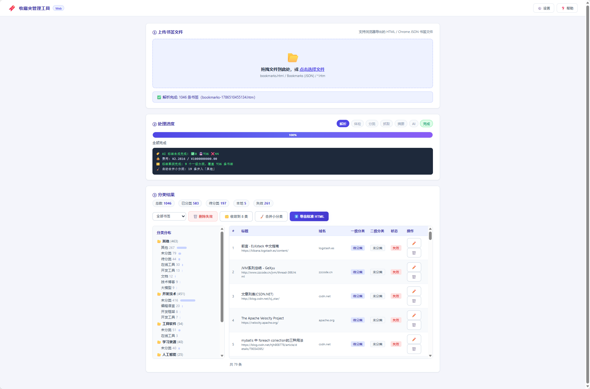

<p align="center">
  
</p>

<h1 align="center">🔖 BookmarkManager · 收藏夹管理工具</h1>

<p align="center">
  上传书签 → 自动解析 → 链接体检 → 网页抓取 → AI 标签 → 频率聚类 → 导出标准书签
  <br>
  <b>全程浏览器操作，一键完成</b>
</p>

<p align="center">
  <a href="#-技术栈">技术栈</a> ·
  <a href="#-功能点">功能点</a> ·
  <a href="#-安装使用">安装使用</a> ·
  <a href="#-配置说明">配置说明</a> ·
  <a href="#-项目结构">项目结构</a> ·
  <a href="#-仓库地址">仓库地址</a> ·
  <a href="#-许可证">许可证</a>
</p>

---

## 📦 名称

**BookmarkManager（收藏夹管理工具）** — 浏览器书签的智能整理助手。把浏览器导出的书签文件拖进页面，自动完成解析、体检、抓取、打标签、聚类分类，导出可直接导回浏览器的标准书签。

- **状态**：Web 版（v2.0+），单页零构建
- **运行方式**：本地服务（FastAPI + 原生 JS 单页），打开浏览器即用

---

## 🧰 技术栈

| 层 | 技术 |
|---|---|
| 后端框架 | [FastAPI](https://fastapi.tiangolo.com/) + [uvicorn](https://www.uvicorn.org/)（SSE 实时进度） |
| 前端 | 原生 HTML / CSS / JavaScript 单页（零构建、零框架） |
| 语言 | Python 3.10+ |
| 依赖管理 | [uv](https://github.com/astral-sh/uv)（`uv sync` 一键安装） |
| 网页抓取 | [Scrapling](https://github.com/D4Vinci/Scrapling) + requests（多引擎兜底，并发 5，超时/重试指数退避） |
| AI 能力 | OpenAI 兼容协议（默认 [DeepSeek](https://deepseek.com/)，可配任意兼容 API），生成标签+摘要 |
| 加密存储 | [cryptography](https://github.com/pyca/cryptography)（API Key 本地加密） |
| 测试 | [pytest](https://docs.pytest.org/)（96 项用例） |
| 其他 | PyYAML / httpx / openpyxl / loguru / tenacity / psutil |

---

## 🖼️ 示例图

<p align="center">
  
</p>

---

## ✨ 功能点

- **📂 上传即处理** — 拖拽浏览器导出的 HTML / Chrome JSON 书签文件，自动开始全流程，无需任何手动步骤
- **🤖 全 AI 自动分类** — 链接体检（本地/失效分流）→ 网页抓取 → 本地摘要 → AI 生成规范标签 → **服务端按标签频率聚类**成两级分类（确定性、可解释、不碎片化），无需维护任何分类/关键词配置
- **🔍 URL 体检分流** — 零成本识别本地/内网与失效链接，自动进系统桶（📁 本地/内网、⚠️ 失效链接）；超时 10s、连续 3 次失败才判失效，防网络抖动误判
- **🏷️ 标签频率聚类** — AI 为每条书签生成 5-10 个规范标签（不直接编分类），服务端统计标签频率：一级 = 全局最热 Top 8 标签，二级 = 每个一级子集内次热 Top 5；结果可解释（「为什么归这类」= 它的标签里出现最多），天然收敛不碎片化
- **📝 本地摘要** — 网页摘要提取（description/H1/高频句，零网络）喂给 AI，大幅降低 token 成本
- **📊 实时进度** — SSE 推送各阶段进度与日志（体检 → 抓取 → 摘要 → AI → 聚类），全程可见，支持随时取消
- **🖥️ 单页操作** — 上传区 → 进度区 → 结果区纵向一页；结果页直接审核（改分类 / 删除 / 一键删失效 / 筛选待分类·本地·失效）
- **🗂️ 分类收敛工具** — 「收敛到 8 类」一键归并旧碎片分类；「合并小分类」把 ≤2 条的小类并进「其他」
- **🌐 代理配置** — 页面内配置代理（抓取国外资源 / AI API 均可走代理），支持一键测试连通性；AI 请求直连优先、失败自动走代理兜底、重试 3 次指数退避
- **🔒 安全可靠** — API Key 加密存储 / 预算上限兜底 / 导出可排除失效与本地书签

---

## 🚀 安装使用

### 环境要求

- Windows / Linux / macOS
- Python 3.10+
- 现代浏览器（Chrome / Edge / Firefox 均可）
- 网络访问权限（抓取网页 + AI API）

### 一键启动（推荐）

**Windows**：双击 `start.bat`（或命令行运行 `start.bat`）
**Linux / macOS**：运行 `./start.sh`

脚本自动完成：**uv sync（安装/更新依赖）→ 启动 webapp → 打开浏览器**。若服务已在运行则直接打开浏览器，不会重复启动。

> 注：`start.bat` 为纯 ASCII（英文提示），避免中文编码在控制台解析出错；界面中文由应用自身提供。`start.sh` 为 UTF-8。

### 源码运行

```bash
uv sync                 # 安装依赖
uv run python webapp.py # 启动服务
```

启动后自动打开浏览器 `http://127.0.0.1:8989`（可在 `config.yaml` 的 `web` 段修改端口）。

### 核心流程（3 步）

1. **上传书签文件** — 浏览器中「导出书签」得到 `bookmarks.html`（或 Chrome 的 `Bookmarks` JSON），拖入页面
2. **自动处理** — 系统自动完成：URL 体检（本地/失效分流）→ 网页抓取（并发 5，单次超时 60s，重试 3 次指数退避）→ 本地摘要 → AI 生成标签 → 服务端按频率聚类，进度与日志实时推送
3. **导出** — 审核结果（改分类 / 一键删失效 / 合并小分类）→ 下载标准 Netscape HTML → 浏览器「导入书签」导回

> 分类由「AI 生成标签 + 服务端频率聚类」两步完成：AI 只做低风险的打标签，两级分类由确定性算法统计得出——同样书签永远得到同样分类。未配置 AI Key 时所有书签保持「待分类」，可在结果页手动归类。失效链接默认不写入导出 HTML（可在配置中改为包含），本地/内网书签默认包含。

---

## ⚙️ 配置说明

### 页面内设置（⚙️ 按钮）

- **代理**：启用 → 填地址/端口 → 「🔌 测试代理」验证；可勾选「AI 请求也走代理」（访问国外 AI API 时有用）
- **AI**：填入 API Key → 「🔑 测试」验证；可配 Base URL / 模型 / 单次预算上限（兼容任何 OpenAI 格式 API）

### config.yaml

| 段 | 说明 |
|---|---|
| `web` | 服务地址/端口/是否自动开浏览器（默认 `127.0.0.1:8989`） |
| `proxy` | 代理设置（enabled / custom / use_for / bypass_domains） |
| `ai` | AI 配置（model / base_url / max_cost_yuan 预算上限） |
| `fetch` | 抓取引擎（scrapling / timeout 60s / max_retries 3 / concurrency 5） |
| `probe` | 探活配置（timeout 10s / max_fail_confirm 3 次，防网络抖动误判失效） |
| `output` | 导出默认值（`export_include_dead: false`、`export_include_local: true`） |

---

## 📁 项目结构

```
BookmarkManager/
├── upload/app.png             # 应用 Logo
├── webapp.py                   # Web 入口 (FastAPI + SSE + 静态服务)
├── start.bat / start.sh        # 一键启动（uv sync + 启动 + 开浏览器）
├── config.yaml                 # 配置（代理/AI/抓取/导出/Web）
├── pyproject.toml / uv.lock    # 依赖 (uv)
├── modules/                    # 核心引擎（纯 Python，零 GUI 依赖）
│   ├── pipeline.py             #   流水线编排（解析→体检→抓取→摘要→AI→聚类）
│   ├── config_manager.py       #   配置管理
│   ├── secure_store.py         #   API Key 加密存储
│   ├── proxy.py                #   代理管理
│   ├── parser.py               #   解析 HTML/JSON 书签
│   ├── bookmark.py             #   数据结构
│   ├── link_probe.py           #   URL 体检（本地/失效三态）
│   ├── summarizer.py           #   本地摘要提取（零网络）
│   ├── fetcher.py              #   网页抓取（多引擎兜底 + 并行）
│   ├── ai_client.py            #   OpenAI 兼容 API 客户端（标签+摘要）
│   ├── tag_classifier.py       #   标签频率聚类（两级分类，确定性算法）
│   └── html_builder.py         #   HTML 生成器（失效/本地过滤）
├── web/static/                 # 单页前端（原生 JS，零构建）
│   ├── index.html              #   页面结构（上传/进度/结果/设置）
│   ├── style.css               #   Indigo 设计系统
│   └── app.js                  #   逻辑（SSE 进度 / 审核 / 导出 / 设置）
├── tests/                      # 测试 (9 个文件, 96 项用例)
│   ├── test_core.py            #   核心链路（解析/HTML）
│   ├── test_probe.py           #   URL 体检
│   ├── test_summarizer.py      #   本地摘要
│   ├── test_ai_prompt.py       #   AI prompt / 解析
│   ├── test_ai_proxy_fallback.py # AI 直连→代理兜底策略
│   ├── test_tag_classifier.py  #   标签频率聚类算法
│   ├── test_export_options.py  #   导出包含选项
│   ├── test_pipeline.py        #   纯 Python 流水线编排
│   └── test_web.py             #   Web API（TestClient）
├── docs/                       # 历史文档
└── data/                       # 运行时数据（自动创建：uploads/exports/cache/logs）
```

---

## 🛠️ 开发

### 运行测试

```bash
# 全量测试（pytest，96 项）
uv run pytest -q tests/

# 或逐文件直接运行（无需 pytest）
PYTHONIOENCODING=utf-8 uv run python tests/test_core.py
PYTHONIOENCODING=utf-8 uv run python tests/test_web.py
```

### 运行服务

```bash
uv run python webapp.py
# → http://127.0.0.1:8989
```

### 日志

运行日志落盘于 `data/logs/webapp.log`，排查问题先看这里。

---

## 🔗 仓库地址

- GitHub：<https://github.com/liuchangng/BookmarkManager>
- Gitee：<http://gitee.com/liuchangng/bookmark-manager>

> 同步镜像仓库，任选其一获取源码、提交 Issue 或参与贡献。

---

## 📄 许可证

本项目基于 **MIT License** 开源，详见 [LICENSE](LICENSE)。

```
MIT License

Copyright (c) 2026 Bookmark Manager Contributors

Permission is hereby granted, free of charge, to any person obtaining a copy
of this software and associated documentation files (the "Software"), to deal
in the Software without restriction, including without limitation the rights
to use, copy, modify, merge, publish, distribute, sublicense, and/or sell
copies of the Software, and to permit persons to whom the Software is
furnished to do so, subject to the following conditions:

The above copyright notice and this permission notice shall be included in all
copies or substantial portions of the Software.

THE SOFTWARE IS PROVIDED "AS IS", WITHOUT WARRANTY OF ANY KIND, EXPRESS OR
IMPLIED, INCLUDING BUT NOT LIMITED TO THE WARRANTIES OF MERCHANTABILITY,
FITNESS FOR A PARTICULAR PURPOSE AND NONINFRINGEMENT. IN NO EVENT SHALL THE
AUTHORS OR COPYRIGHT HOLDERS BE LIABLE FOR ANY CLAIM, DAMAGES OR OTHER
LIABILITY, WHETHER IN AN ACTION OF CONTRACT, TORT OR OTHERWISE, ARISING FROM,
OUT OF OR IN CONNECTION WITH THE SOFTWARE OR THE USE OR OTHER DEALINGS IN THE
SOFTWARE.
```

---

## 📝 更新日志

详见 [CHANGELOG.md](CHANGELOG.md)。

---

*Made with ❤️ for bookmark hoarders everywhere*
